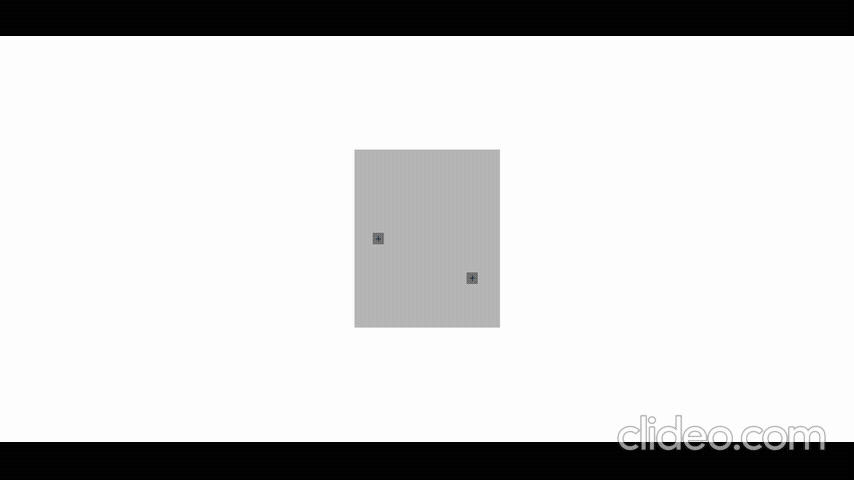
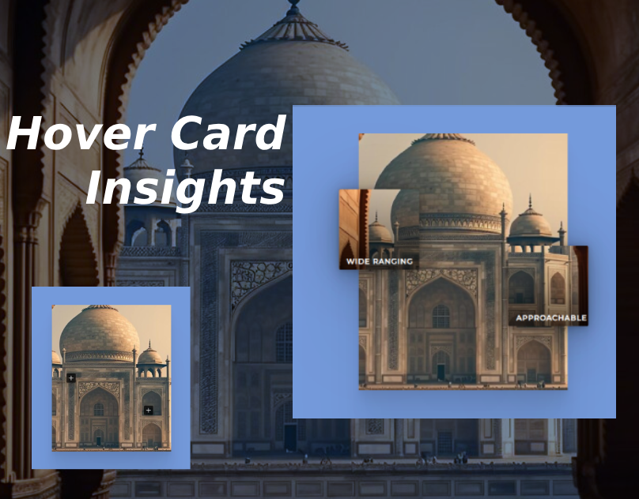

# HoverCard Insights – Interactive Hover Effects for Chrome

### Author
##### Virendra D. Verma

<a href="https://www.linkedin.com/in/dharmendraverma95/" target="_blank">LinkedIn Profile </a>

<a href="https://www.behance.net/dhirukumar" target="_blank">Behance Profile </a>

# Project Overview
HoverCard Insights is an intuitive web-based project designed to deliver seamless, interactive hover effects on cards. Enhance user experience with information-rich hover interactions, optimized for the Chrome browser. Perfect for modern web interfaces, e-commerce, portfolios, and more.

## Features

- **Smooth Interactions**: Seamless hover animations that reveal additional information.
- **Customizable**: Easily change hover styles, colors, and effects to fit your design.

# Preview
HoverCard Insights Card Design Section
 

 
HoverCard Insights Card Design Section Start & End Point 
 

 
HoverCard Insights Card Design Section UI UX Layout Start & End Point
 

 
HoverCard Insights Card Design Section UI UX Layout
 

 
Cover
 

 

### Technologies Used
<ul>
  <li>Graphic Design Software: Photoshop, Figma (for mockups)</li>
  <li>Web Tools (Optional): HTML5, CSS3 for any digital presentations or landing pages</li>
</ul>